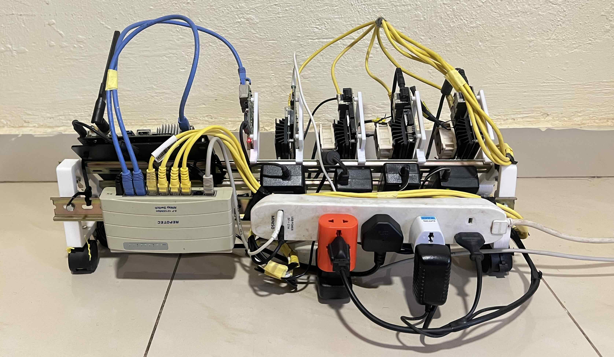

# Edge Homelab
Welcome to the Edge  HomeLab project. This project aims to explore basic networking, Kubernetes, distributed systems, and machine learning in a hands-on, practical way.

<!--  -->
<!--  -->

#### Project Goals

1- Basic Networking

 -  Understand IP addressing, subnetting, and DNS.

 - Set up and manage a local network for connected devices.

2 - Kubernetes

- Deploy and manage containerized applications.

- Learn how to scale applications across multiple devices.

3 - Distributed Systems

- Explore distributed computing frameworks.

- Set up a distributed file system for data sharing.

Machine Learning

- Utilize GPUs for accelerated training and inference.

- Experiment with distributed training techniques.

## Set Up HomeLab Environment

### Organize Devices:

| **Role**       | **Device**         | **Use Case**                               |
| -------------- | ------------------ | ------------------------------------------ |
| Master Node    | TX2                | Orchestrates training, aggregates results. |
| Worker Nodes   | Jetson Nano 4G x4  | Train on data subsets.                     |
| Worker Nodes   | Jetson Nano 2G x1  | Train on data subsets.                     |
| Storage Server | TX2 / Raspberry Pi | NAS or object storage.                     |

or 

| Device       | Number | Use Case                                  |
| ------------ | ------ | ----------------------------------------- |
| Nano 4G      | 4      | GPU-accelerated tasks, ML workloads       |
| Nano 2G      | 1      | Lightweight services or worker node       |
| TX2          | 2      | High-performance ML and distributed tasks |
| Raspberry Pi | 1      | Kubernetes master node, controller        |

## 3D Printed Parts: 

- [Nvidia Jetson Nano DIN rail mount](https://www.stlfinder.com/model/nvidia-jetson-nano-din-rail-mount-0GMeNTmN/4430214/)
- [DIN Rail Development Rig](https://www.thingiverse.com/thing:3433772)
- [DIN rail mount (8 pts)](https://www.thingiverse.com/thing:3487867)
- [DIN Rail Stand KIT](https://www.thingiverse.com/thing:3609072)

## Power Management: 
- Power Supply 
## Networking: 
- Repeater and Hub 
## Area of Exploration:
- Orchestrates e.g Kubernetes, K3s, Microk8s
- Distributed Systems
- Machine Learning
  - Data Parallelism
  - Mmodel Parallelism
  - Federated Learning
- Infrastructure as Code(IaC)
- Network and Communication
  - Network Protocols: gRPC and MPI for communication between nodes.
  - Network Communcation libararies e.g NCCL, MPI, GLOO etc

### Future Enhancements:

- Integrate CI/CD pipelines for automated deployments.
- Explore edge computing with the Jetson boards.
- Upgrade the Jetson Nano to Jetson Orin Super and benchmark both set configurations. 