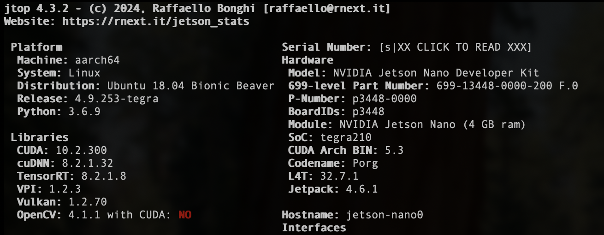
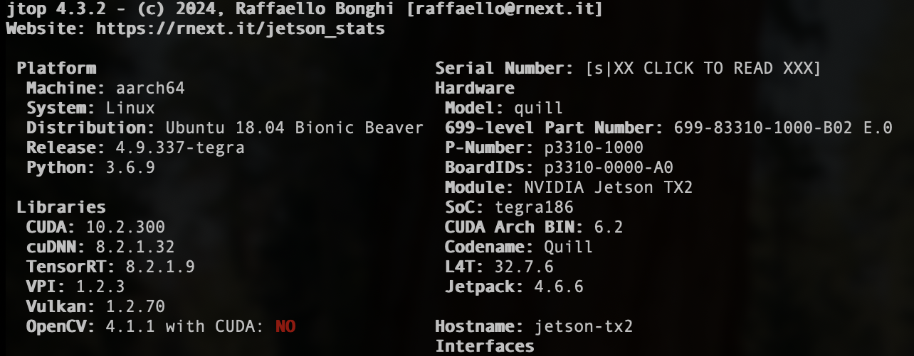

Jetson-Nano 

Jetson-TX2

| Feature               | Jetson Nano 4GB                     | Jetson TX2                                                           |
| --------------------- | ----------------------------------- | -------------------------------------------------------------------- |
| **CPU**               | Quad-core ARM Cortex-A57 @ 1.43 GHz | Dual-core NVIDIA Denver 2 + Quad-core ARM Cortex-A57 @ up to 2.0 GHz |
| **GPU**               | 128-core NVIDIA Maxwell @ 921 MHz   | 256-core NVIDIA Pascal @ 1.3 GHz                                     |
| **Memory (RAM)**      | 4 GB LPDDR4                         | 8 GB LPDDR4                                                          |
| **Storage**           | microSD card slot                   | 32 GB eMMC                                                           |
| **AI Performance**    | 0.5 TFLOPS (FP16)                   | 1.33 TFLOPS (FP16)                                                   |
| **Video Support**     | 4K @ 30 fps                         | 4K @ 60 fps                                                          |
| **Connectivity**      | Gigabit Ethernet                    | Gigabit Ethernet, Wi-Fi (2.4/5 GHz), Bluetooth                       |
| **Power Consumption** | 5–10 W                              | 7.5–15 W                                                             |
| **Form Factor**       | 100 mm x 80 mm x 29 mm              | 50 mm x 87 mm x 6 mm                                                 |